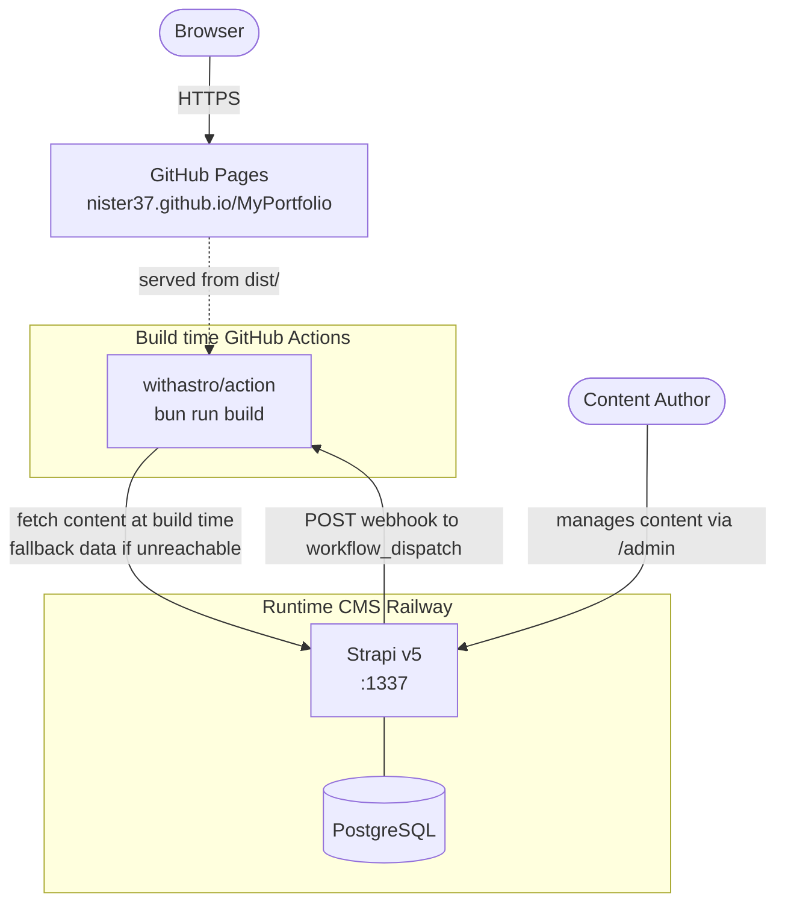
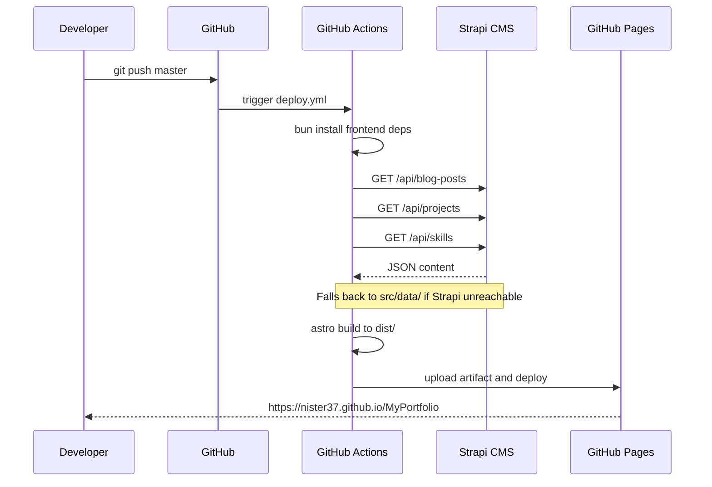
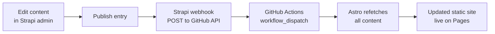
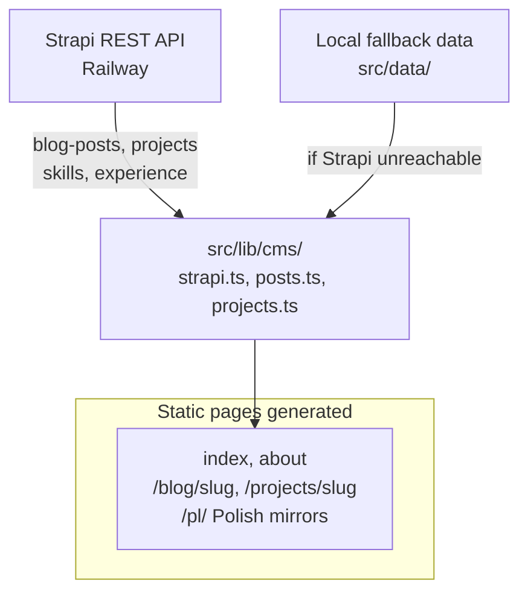
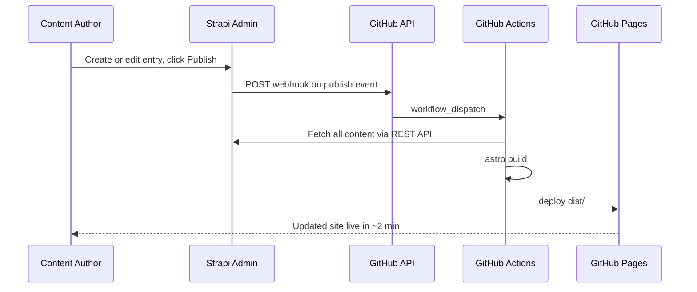
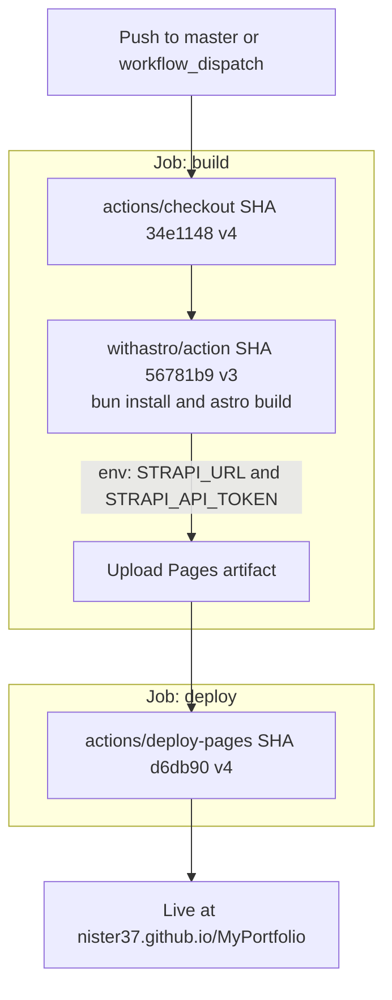

# MyPortfolio
Bilingual (EN / PL) personal portfolio. Static Astro frontend deployed to GitHub Pages, headless Strapi CMS hosted on Railway.
**Live site:** [nister37.github.io/MyPortfolio](https://nister37.github.io/MyPortfolio)  
**CMS admin:** [myportfolio-production-38ce.up.railway.app/admin](https://myportfolio-production-38ce.up.railway.app/admin)
---
## Table of contents
- [Architecture](#architecture)
- [Tech stack](#tech-stack)
- [Repository layout](#repository-layout)
- [Local development](#local-development)
- [Environment variables](#environment-variables)
- [Build and preview](#build-and-preview)
- [Deployment](#deployment)
- [Content management](#content-management)
- [CI/CD pipeline](#cicd-pipeline)
- [Security notes](#security-notes)
---
## Architecture
### System overview

### Build and deploy pipeline

### Content update flow

### Data flow at build time

---
## Tech stack
| Layer | Technology | Purpose |
|-------|-----------|---------|
| Frontend framework | [Astro 6](https://astro.build) | Static site generation, island architecture |
| Interactive islands | [Svelte 5](https://svelte.dev) | Project filter, particles background, custom cursor, theme toggle |
| Styling | [Tailwind CSS v4](https://tailwindcss.com) + [daisyUI 5](https://daisyui.com) + Sass | Utility-first layout, component classes, design tokens |
| Icons | [@iconify-json/devicon](https://icon-sets.iconify.design/devicon/) + [lucide-svelte](https://lucide.dev) | Tech stack icons, UI icons |
| Package manager | [Bun](https://bun.sh) | Fast installs, frontend dev/build |
| CMS | [Strapi v5](https://strapi.io) | Headless CMS, admin panel, REST API |
| CMS database | PostgreSQL (Railway) / SQLite (local dev) | Content storage |
| CMS hosting | [Railway](https://railway.app) | Managed Node.js hosting |
| Frontend hosting | [GitHub Pages](https://pages.github.com) | Free static hosting |
| CI/CD | [GitHub Actions](https://github.com/features/actions) + [withastro/action](https://github.com/withastro/action) | Build and deploy on push |
| XSS protection | [isomorphic-dompurify](https://github.com/kkomelin/isomorphic-dompurify) | Sanitize CMS HTML before set:html |
| i18n | Astro i18n routing | EN default, /pl/ prefix for Polish |
---
## Repository layout
```
MyPortfolio/
├── frontend/                    # Astro static site
│   ├── src/
│   │   ├── components/
│   │   │   ├── layout/          # Header, Footer, Section
│   │   │   ├── home/            # Hero, FeaturedProjects, SkillsOverview,
│   │   │   │                    # ExperienceTimeline, BlogPreview, ContactCta
│   │   │   ├── projects/        # ProjectCard, ProjectFilter (Svelte)
│   │   │   ├── blog/            # BlogCard
│   │   │   └── ui/              # CustomCursor (Svelte), ParticlesBackground (Svelte),
│   │   │                        # ThemeToggle, LanguageSwitcher
│   │   ├── layouts/             # BaseLayout.astro
│   │   ├── pages/               # index, about, projects/[slug], blog/[slug]
│   │   │   └── pl/              # Polish mirror routes
│   │   ├── lib/
│   │   │   ├── url.ts           # Shared BASE_URL constant (single source of truth)
│   │   │   └── cms/             # strapi.ts, posts.ts, projects.ts
│   │   ├── data/                # Fallback content used when Strapi is unreachable
│   │   └── styles/              # global.css (Tailwind + daisyUI), custom.scss
│   ├── public/                  # favicon, CNAME, cv-en.pdf, cv-pl.pdf
│   ├── astro.config.mjs
│   └── package.json
│
├── cms/                         # Strapi v5 CMS
│   ├── src/api/                 # Content types: blog-post, project, skill,
│   │                            # experience, site-setting
│   ├── config/
│   │   ├── middlewares.ts       # CORS locked to GitHub Pages + Railway origins
│   │   ├── database.ts          # SQLite locally, PostgreSQL via DATABASE_URL
│   │   └── server.ts
│   ├── railway.toml             # Railway build/deploy/healthcheck config
│   └── package.json
│
├── .github/
│   └── workflows/
│       └── deploy.yml           # Build frontend + deploy to GitHub Pages
└── README.md
```
---
## Local development
### Prerequisites
| Tool | Min version | Install |
|------|-------------|---------|
| Git | any | [git-scm.com](https://git-scm.com) |
| Bun | >= 1.x | https://bun.sh |
| Node.js | >= 22 LTS | [nodejs.org](https://nodejs.org) |
Verify:
```bash
git --version
bun --version
node --version
npm --version
```
### Clone
```bash
git clone https://github.com/Nister37/MyPortfolio.git
cd MyPortfolio
```
### Start the frontend
```bash
cd frontend
bun install
bun run dev
```
Dev server: **http://localhost:4321**
If Strapi is not running, the frontend automatically uses fallback data from `src/data/`. All pages build and render normally.
### Start the CMS
```bash
cd cms
npm install
npm run develop
```
Strapi admin: **http://localhost:1337/admin**
Create an admin account on first run. Strapi uses **SQLite** by default — no database setup required locally.
---
## Environment variables
### Frontend — `frontend/.env`
```bash
cp frontend/.env.example frontend/.env
```
| Variable | Required | Default | Description |
|----------|----------|---------|-------------|
| `STRAPI_URL` | No | `http://localhost:1337` | Base URL of your Strapi instance |
| `STRAPI_API_TOKEN` | No | (none) | Read-only API token from Strapi admin |
```env
STRAPI_URL=http://localhost:1337
STRAPI_API_TOKEN=
```
Both variables are **build-time only**. They are never exposed to the browser.
### CMS — `cms/.env`
| Variable | Required | Description |
|----------|----------|-------------|
| `APP_KEYS` | **Yes** | Four comma-separated random secrets for session signing |
| `API_TOKEN_SALT` | **Yes** | Salt for API token hashing |
| `ADMIN_JWT_SECRET` | **Yes** | JWT secret for admin sessions |
| `TRANSFER_TOKEN_SALT` | **Yes** | Salt for data transfer tokens |
| `JWT_SECRET` | **Yes** | JWT secret for content API tokens |
| `DATABASE_URL` | Production | PostgreSQL connection string (injected by Railway) |
Generate random secrets:
```bash
node -e "console.log(require('crypto').randomBytes(32).toString('base64'))"
```
---
## Build and preview
```bash
cd frontend
# Full production build (fetches from STRAPI_URL, falls back to src/data/)
bun run build
# Serve the generated dist/ locally
bun run preview
```
The build **always succeeds** even when Strapi is unreachable — fallback content is substituted and the build continues.
---
## Deployment
### Frontend to GitHub Pages
Every push to `master` triggers automatic deployment via GitHub Actions.
**One-time GitHub setup:**
1. `Settings -> Pages -> Build and deployment -> Source:` **GitHub Actions**
2. `Settings -> Secrets -> Actions` — add two repository secrets:
| Secret | Value |
|--------|-------|
| `STRAPI_URL` | `https://myportfolio-production-38ce.up.railway.app` |
| `STRAPI_API_TOKEN` | Read-only token from Strapi admin (scoped to blog-post and project) |
### CMS to Railway
Railway auto-deploys from the `cms/` directory on every push to `master`.
**One-time Railway setup:**
1. Connect the repository to a Railway project
2. Set all CMS environment variables in the service dashboard
3. Add a PostgreSQL plugin — Railway injects `DATABASE_URL` automatically
Configuration lives in `cms/railway.toml`:
```toml
[build]
builder = "nixpacks"
buildCommand = "npm run build"
[deploy]
startCommand = "npm run start"
healthcheckPath = "/_health"
healthcheckTimeout = 30
restartPolicyType = "on_failure"
restartPolicyMaxRetries = 3
```
---
## Content management
### With webhook (automatic rebuild)

### Manual rebuild
1. Open the [Strapi admin panel](https://myportfolio-production-38ce.up.railway.app/admin)
2. Create or edit content in **Blog Posts**, **Projects**, **Skills**, or **Experience**
3. Click **Publish**
4. Go to **GitHub -> Actions -> Deploy Portfolio Frontend -> Run workflow**
### Local workflow
```bash
# Terminal 1 — CMS
cd cms && npm run develop
# Terminal 2 — Frontend
cd frontend && bun run dev
```
Edit content at `http://localhost:1337/admin`, publish, then refresh the Astro dev server.
---
## CI/CD pipeline

All actions are pinned to **commit SHAs** to prevent supply-chain attacks from mutable version tags.
The `concurrency` block prevents a running deploy from being cancelled by a racing push:
```yaml
concurrency:
  group: github-pages
  cancel-in-progress: false
```
---
## Security notes
| Concern | Mitigation |
|---------|-----------|
| XSS via CMS HTML | `isomorphic-dompurify` sanitizes all `set:html` content at build time |
| CORS | Strapi CORS locked to `nister37.github.io` and the Railway URL; methods restricted to GET, HEAD, OPTIONS |
| API token in browser | `STRAPI_API_TOKEN` is build-time only, never in `PUBLIC_*` variables |
| Supply-chain CI | All GitHub Actions pinned to commit SHAs, not floating version tags |
| Secrets in source | No keys committed; Railway and GitHub Actions inject them at runtime |
| API token scope | Set `STRAPI_API_TOKEN` to read-only, scoped to `blog-post` and `project` in Strapi admin |